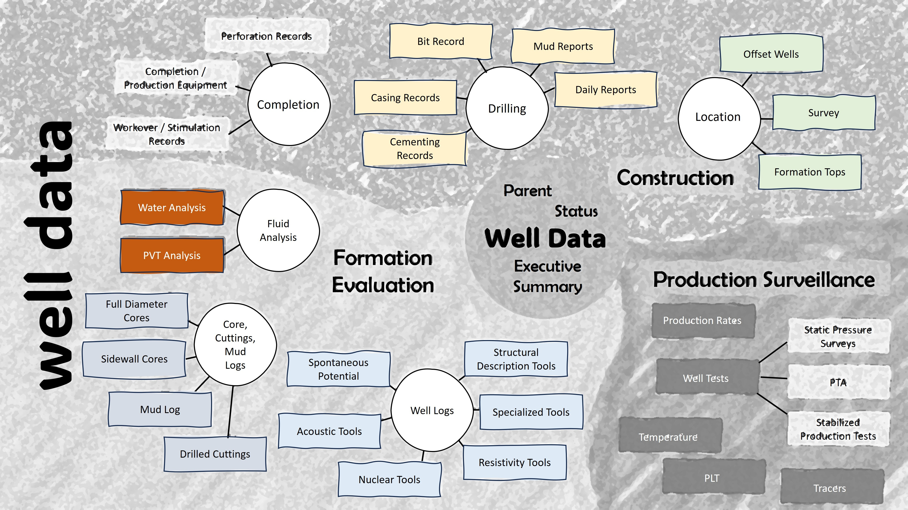

# well-data-streaming

`wellx` is a Python-based repository that provides a structured dictionary for streaming and organizing well-related data. It helps standardize how various datasets are handled across drilling, completion, production, and operations disciplines.

## 🚀 Key Features

- Unified dictionary structure for multiple well domains:
  - Drilling
  - Completion
  - Production
  - Operations
- Facilitates clean and efficient streaming of data between systems or modules.
- Designed for integration with data pipelines and visualization tools.
- Promotes consistency and scalability in well data management.

---

